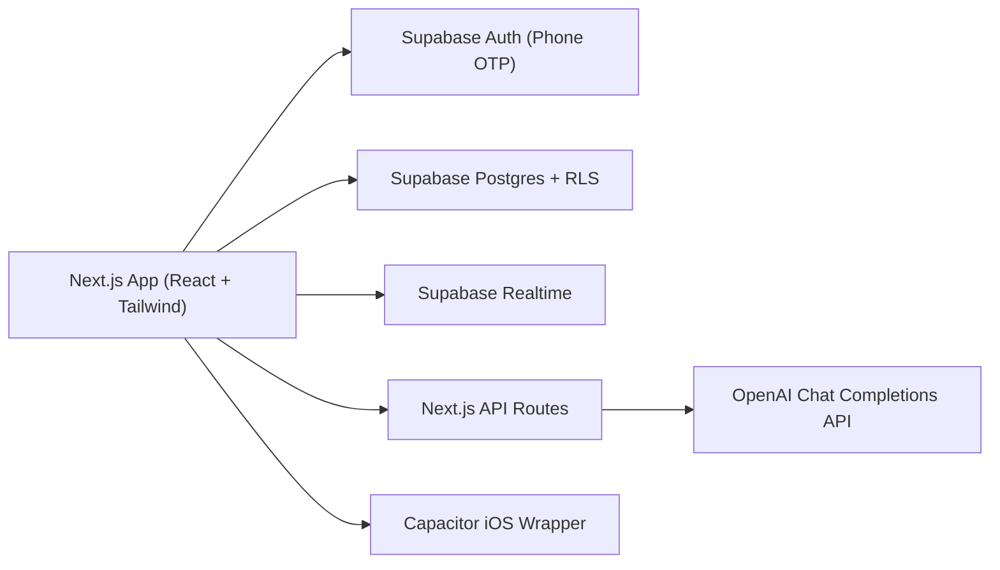

# plus1

**Hangouts, without the group text.**

plus1 is a mobile-first social app for finding casual things to do and people to do them with. Instead of coordinating through messy group chats, users can discover nearby plans, join events, host their own, message friends or attendees, and use AI to turn rough ideas or flyers into event drafts.

Live app: https://plus1-livid.vercel.app  

---

## Problem & Motivation

I built plus1 because casual social plans are often harder to coordinate than they should be.

A lot of everyday plans start with something simple like "who wants to get food?" or "anyone down to study?" But in practice, those plans get buried in group chats, depend on knowing who is free, and require someone to take the initiative. Existing event platforms usually feel too formal for small, spontaneous plans, while group chats can be messy or awkward.

plus1 is designed for lightweight plans: grabbing lunch, studying, playing basketball, going to the gym, taking a walk, or finding people who are down to do something nearby. The goal is not to make another endless social media feed, but to reduce the friction between wanting to do something and actually finding people to do it with.

---

## What I Built

plus1 is a functional mobile-first web app with authentication, profiles, event discovery, event creation, joining/leaving, friend requests, messaging, activity updates, AI-assisted event drafting, and iOS testing through Capacitor.

Core features include:

- phone OTP authentication with Supabase Auth
- first-run profile setup after sign-in
- editable profiles with display name, handle, pronouns, bio, interests, profile photo, website, and local area
- home feed of open events
- event search and category filters
- local-area filtering for more realistic nearby plans
- event creation, editing, joining, leaving, and closing
- host-only controls for editing and closing open events
- event detail pages with attendees, status badges, and share actions
- event card image uploads
- people search, suggested nearby users, friend requests, and friends list
- friends-only direct messages
- host/attendee event chats
- activity feed for joins, edits, closures, invites, and friend activity
- unread badges for activity and messages
- Supabase Realtime subscriptions for feed, activity, friendship, and messaging updates
- shareable public event preview links
- AI text-to-event drafting
- AI flyer-image-to-event extraction
- Capacitor iOS wrapper for native-device testing

A typical user flow is:

1. Sign in with phone OTP.
2. Complete a profile.
3. Browse nearby events.
4. Join an event or create a new one.
5. Use event chat after joining.
6. Add friends and message them directly.
7. Use AI to draft an event from text or a flyer.
8. Share an event card with others.

---

## Technical Implementation

plus1 is built as a mobile-first Next.js app and deployed on Vercel. I used Capacitor so the deployed web app could also be tested in an iOS shell without needing a full native rewrite or App Store submission.

Tech stack:

- Next.js 16 with App Router
- React 19
- TypeScript
- Tailwind CSS 4
- Supabase Auth
- Supabase Postgres with Row Level Security
- Supabase Realtime
- OpenAI API
- Capacitor iOS
- Vercel

Supabase handles authentication, database storage, permissions, and live updates. The app uses RLS policies and server-side database functions for important authorization behavior such as event visibility and atomic joins.

OpenAI is used for the AI drafting features. The AI routes are server-side, require a signed-in user, include basic rate/input guards, and validate/clamp model output before using it. The app does not blindly trust raw AI JSON.

---

## Development Process & Iteration

plus1 started as a simpler mobile-first event discovery MVP. As I built and tested it, I realized that just showing events was not enough. For the app to feel useful, it needed more of the social layer around events.

Major iterations included:

- adding authenticated profiles instead of anonymous browsing
- adding first-run profile setup after phone sign-in
- adding local-area filtering so events felt realistic instead of global
- adding richer profile fields and profile photo uploads
- adding friend requests and friends-only direct messages
- adding host/attendee event chats
- adding activity updates and unread badges
- adding Realtime subscriptions for fresher app state
- adding AI drafting to make event creation faster
- adding public event share previews
- polishing the mobile UI and iOS safe-area behavior through Capacitor testing

A major design decision was to keep plus1 focused on casual, everyday plans instead of formal events. I wanted the app to feel low-pressure enough that someone could post a small plan without making it a big deal.

---

## AI Usage & Disclosure

I used AI tools during development. I used ChatGPT for ideation, planning, writing help, debugging support, and thinking through product direction. I used Codex and Cursor for coding assistance and implementation help.

AI is also part of the product itself. plus1 uses OpenAI API routes to draft event details from text prompts and extract event information from flyers. Because AI output can be wrong or incomplete, the app validates and clamps AI JSON output server-side before using it.

---

## Known Limitations

plus1 is a course project prototype and is not production-ready as a real social platform yet.

Current limitations include:

- real SMS delivery in the US may require Twilio A2P 10DLC registration
- Supabase Test OTP is the most reliable auth path for demos
- AI flyer extraction can miss or hallucinate details from noisy images
- native push token registration is best-effort
- production push notification delivery is not fully wired
- network effects are limited without enough active local users
- local area is profile-selected for demo purposes and is not GPS-verified
- trust and safety features are documented but incomplete

---

## Future Work

The biggest future direction is trust and safety. A real version of plus1 would need stronger safety systems before being used by a larger community.

Future features I would add include:

- report flows for events and users
- block and mute controls
- stronger privacy settings
- host reputation or verification signals
- moderator tools for unsafe events or profiles
- better production push notifications
- message push notifications
- stronger location verification
- deeper event recommendations based on interests, friends, time, and location
- deep links for opening shared events directly in the app
- more structured user feedback and usage analytics

I would also want to test the app with a larger group of students to see whether people would actually use plus1 for spontaneous plans instead of relying on existing group chats.

---

## Reproducible Demo Flow

A short demo can follow this flow:

1. Open the app and sign in through Supabase Test OTP or SMS.
2. Complete first-run profile setup.
3. Browse the home feed and events page.
4. Search and filter events by category.
5. Open an event detail page and inspect attendees.
6. Join an event and open the event chat.
7. Check the activity feed and unread badge.
8. Open messages and direct message a friend.
9. Create an event manually.
10. Create another event draft through AI text input.
11. Extract event details from a flyer image.
12. Share an event card.
13. Edit profile information and verify persistence.
