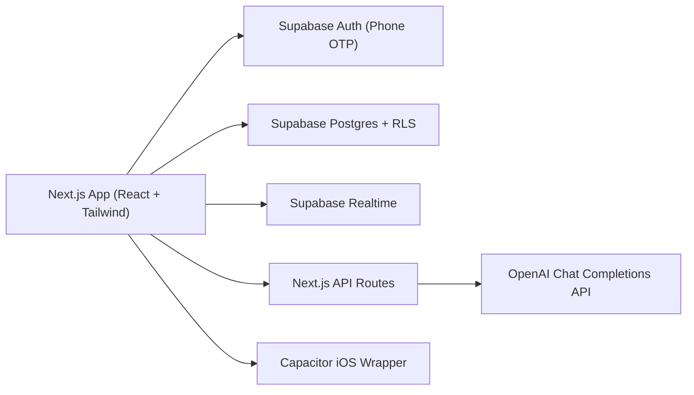

# plus1

Campus hangouts, without the group text.

plus1 is a mobile-first social app for lightweight campus plans ("quests"). Students can sign in with phone OTP, discover plans, join or host events, and use AI to draft quest details from text or flyers.

## Why this project

Most campus coordination happens in fragmented group chats. plus1 tries to reduce that friction with:

- one-tap quest discovery
- low-pressure joins/leaves
- clear host ownership and capacity limits
- AI-assisted draft creation for faster posting

## Current feature set

### Auth and profile

- Phone-only OTP authentication (Supabase Auth)
- Session persistence across refresh and native app relaunch
- Automatic profile bootstrap on first sign-in
- Profile editing (display name, bio, interests)

### Quests

- Home feed of open quests
- Explore screen with search + category filters
- Create quest flow with form validation
- Join / leave quest
- Host edit / close quest
- Quest detail with attendees and status badges
- Shareable quest card with native share sheet / clipboard fallback

### Activity and realtime

- Activity feed for joins, edits, and closures
- Unread activity badge on tab bar
- Supabase Realtime subscriptions for live updates
- Local notifications on native iOS (best-effort)

### AI flows

- Text-to-quest drafting: `app/api/ai/quest-draft/route.ts`
- Flyer-image-to-quest extraction: `app/api/ai/flyer-to-quest/route.ts`
- Server-side validation/clamping of AI JSON output in `lib/aiQuestDraft.ts`

## Architecture



## Tech stack

- Next.js 16 (App Router), React 19, TypeScript
- Tailwind CSS 4
- Supabase (Auth, Postgres, Realtime)
- OpenAI API (quest drafting)
- Capacitor iOS shell for native testing
- Vercel for deployment

## Quick start (local)

### 1) Install

```bash
npm install
```

### 2) Configure environment variables

```bash
cp .env.example .env.local
```

Required vars in `.env.local`:

- `NEXT_PUBLIC_SUPABASE_URL`
- `NEXT_PUBLIC_SUPABASE_ANON_KEY`
- `OPENAI_API_KEY` (required for AI draft routes)

Optional vars:

- `OPENAI_MODEL` (defaults to `gpt-4o-mini`)
- `DEV_ORIGIN` (optional LAN override in `next.config.ts`)

### 3) Apply Supabase migrations

Apply all SQL files in `supabase/migrations/` (or use the combined schema in `supabase/schema.sql`) in your Supabase project.

Minimum migrations for current feature set:

- `supabase/migrations/20260529_auth_rls_upgrade.sql`
- `supabase/migrations/20260529_push_tokens.sql`
- `supabase/migrations/20260530045200_phone_auth_profiles.sql`
- `supabase/migrations/20260530045300_profile_bio_interests.sql`
- `supabase/migrations/20260530045400_activity_events.sql`

### 4) Enable Realtime for activity feed

Ensure `activity_events` is part of publication `supabase_realtime`.

### 5) Configure phone auth (choose one)

- Real SMS path: Supabase Phone provider with Twilio credentials and Messaging Service SID.
- Fast test path: Supabase "Test phone numbers and OTP" pair (recommended for demos).

### 6) Run app

```bash
npm run dev
```

Open `http://localhost:3000`.

## iPhone testing

- Ensure `capacitor.config.ts` points to your deployed URL (or local URL setup if desired)
- Sync/open iOS project:

```bash
npm run cap:sync:ios
npm run cap:open:ios
```

## Production deploy (Vercel)

1. Set environment variables in Vercel project settings:
   - `NEXT_PUBLIC_SUPABASE_URL`
   - `NEXT_PUBLIC_SUPABASE_ANON_KEY`
   - `OPENAI_API_KEY`
   - optional `OPENAI_MODEL`
2. Deploy:

```bash
npx vercel deploy --prod
```

## Scripts

- `npm run dev` - run dev server on LAN
- `npm run build` - production build
- `npm run start` - start production server locally
- `npm run lint` - lint codebase
- `npm run test` - run unit + integration tests (integration auto-skips when env is missing)
- `npm run test:unit` - run lightweight deterministic unit tests
- `npm run cap:sync:ios` - sync Capacitor iOS project
- `npm run cap:open:ios` - open iOS project in Xcode
- `npm run cap:run:ios` - run on selected iOS target

## Reproducible 5-minute demo checklist

1. Open app and sign in via Test OTP (or Twilio SMS).
2. Confirm first-run profile setup appears for new users.
3. Create a quest manually.
4. Create another quest draft via AI text prompt.
5. Open Explore and filter/search quests.
6. Join a quest and verify Activity tab updates.
7. Open quest detail and share the quest card.
8. Edit profile bio/interests and verify persistence.

## Project documentation for submission

- Evaluation evidence: `docs/evaluation.md`
- AI/process disclosure: `docs/ai-disclosure.md`
- Demo script: `docs/demo-script.md`

## Known limitations

- Real SMS delivery in US may require Twilio A2P 10DLC registration.
- AI flyer extraction can miss or hallucinate event details from noisy images.
- Native push token registration is best-effort in development builds.
- Network effects are limited without enough active campus users.
