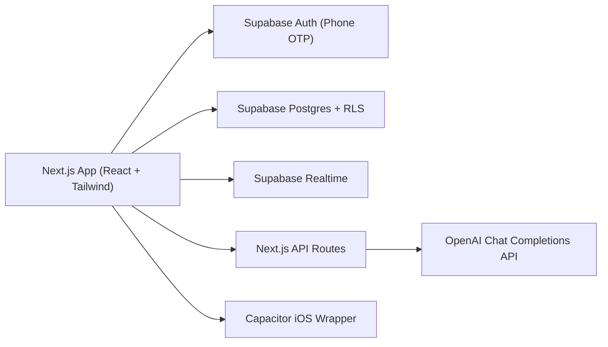

# plus1

Hangouts, without the group text.

plus1 is a mobile-first social app for lightweight events. People can sign in with phone OTP, discover realistic nearby plans, join or host events, and use AI to draft event details from text or flyers.

## Why this project

Most casual coordination happens in fragmented group chats. plus1 tries to reduce that friction with:

- one-tap event discovery
- frictionless joins/leaves
- clear host ownership and capacity limits
- AI-assisted draft creation for faster posting

## Current feature set

### Auth and profile

- Phone-only OTP authentication (Supabase Auth)
- Session persistence across refresh and native app relaunch
- Automatic profile bootstrap on first sign-in
- Profile editing (display name, unique @handle, local area, bio)

### Events

- Home feed of open events
- Lightweight local-area filtering so users see realistic nearby events
- Events screen with search + category filters
- People screen with search, suggestions, friend requests, and friends
- Create event flow with form validation
- Join / leave event
- Host edit / close event
- Event detail with attendees and status badges
- Shareable event card with native share sheet / clipboard fallback

### Activity, messages, and realtime

- Activity feed for joins, edits, and closures
- Home header bell with unread activity badge
- Friends-only direct messages and host/attendee event chats
- Home header messages button with unread chat badge
- Supabase Realtime subscriptions for live updates
- Local notifications on native iOS (best-effort)

### AI flows

- Text-to-event drafting: `app/api/ai/quest-draft/route.ts`
- Flyer-image-to-event extraction: `app/api/ai/flyer-to-quest/route.ts`
- Server-side validation/clamping of AI JSON output in `lib/aiQuestDraft.ts`
- AI routes require a signed-in user and include basic input/rate limits

## Architecture



## Tech stack

- Next.js 16 (App Router), React 19, TypeScript
- Tailwind CSS 4
- Supabase (Auth, Postgres, Realtime)
- OpenAI API (event drafting)
- Capacitor iOS shell for native testing
- Vercel for deployment

## Quick start (local)

### 1) Install

```bash
npm install
```

### 2) Configure environment variables

```bash
cp .env.example .env.local
```

Required vars in `.env.local`:

- `NEXT_PUBLIC_SUPABASE_URL`
- `NEXT_PUBLIC_SUPABASE_ANON_KEY`
- `NEXT_PUBLIC_SITE_URL` (used for public share preview links; production is `https://plus1-livid.vercel.app`)
- `OPENAI_API_KEY` (required for AI draft routes)

Optional vars:

- `OPENAI_MODEL` (defaults to `gpt-4o-mini`)
- `DEV_ORIGIN` (optional LAN override in `next.config.ts`)

### 3) Apply Supabase migrations

Apply all SQL files in `supabase/migrations/` (or use the combined schema in `supabase/schema.sql`) in your Supabase project.

Minimum migrations for current feature set:

- `supabase/migrations/20260529_auth_rls_upgrade.sql`
- `supabase/migrations/20260529_push_tokens.sql`
- `supabase/migrations/20260530045200_phone_auth_profiles.sql`
- `supabase/migrations/20260530045300_profile_bio_interests.sql`
- `supabase/migrations/20260530045400_activity_events.sql`
- `supabase/migrations/20260530053000_profile_handles.sql`
- `supabase/migrations/20260530054500_profile_website_url.sql`
- `supabase/migrations/20260530060000_profile_photos_events_categories.sql`
- `supabase/migrations/20260530061000_quest_card_images.sql`
- `supabase/migrations/20260531020500_nullable_quest_start_time.sql`
- `supabase/migrations/20260531030000_profile_pronouns.sql`
- `supabase/migrations/20260531040000_course_hardening.sql`
- `supabase/migrations/20260531043000_local_area_boundary.sql`
- `supabase/migrations/20260531052000_event_visibility_invites.sql`
- `supabase/migrations/20260531060000_local_visibility_name.sql`
- `supabase/migrations/20260531223000_public_quest_share_links.sql`
- `supabase/migrations/20260531233000_messaging_threads.sql`

### 4) Enable Realtime for activity and messages

Ensure `activity_events`, `message_threads`, `message_thread_participants`, and `messages` are part of publication `supabase_realtime`.

### 5) Configure phone auth (choose one)

- Real SMS path: Supabase Phone provider with Twilio credentials and Messaging Service SID.
- Fast test path: Supabase "Test phone numbers and OTP" pair (recommended for demos).

### 6) Run app

```bash
npm run dev
```

Open `http://localhost:3000`.

## iPhone testing

- Ensure `capacitor.config.ts` points to your deployed URL (or local URL setup if desired)
- Sync/open iOS project:

```bash
npm run cap:sync:ios
npm run cap:open:ios
```

## Production deploy (Vercel)

1. Set environment variables in Vercel project settings:
   - `NEXT_PUBLIC_SUPABASE_URL`
   - `NEXT_PUBLIC_SUPABASE_ANON_KEY`
   - `OPENAI_API_KEY`
   - optional `OPENAI_MODEL`
2. Deploy:

```bash
npx vercel deploy --prod
```

## Scripts

- `npm run dev` - run dev server on LAN
- `npm run build` - production build
- `npm run start` - start production server locally
- `npm run lint` - lint codebase
- `npm run test` - run unit + integration tests (integration auto-skips when env is missing)
- `npm run test:unit` - run lightweight deterministic unit tests
- `npm run cap:sync:ios` - sync Capacitor iOS project
- `npm run cap:open:ios` - open iOS project in Xcode
- `npm run cap:run:ios` - run on selected iOS target

## Reproducible 5-minute demo checklist

1. Open app and sign in via Test OTP (or Twilio SMS).
2. Confirm first-run profile setup appears for new users.
3. Create an event manually.
4. Create another event draft via AI text prompt.
5. Open Events and filter/search events.
6. Join an event and verify the Home bell opens Activity.
7. Open event detail and verify Chat appears after joining.
8. Open Messages from Home and verify Inbox loads.
9. Edit profile bio/interests and verify persistence.

## Supabase integration test environment

`npm run test` always runs unit tests. The RLS integration tests in
`lib/questService.test.mjs` run when these variables are present:

- `NEXT_PUBLIC_SUPABASE_URL`
- `NEXT_PUBLIC_SUPABASE_ANON_KEY`
- `PLUS1_TEST_PASSWORD`
- `PLUS1_TEST_EMAIL_HOST`
- `PLUS1_TEST_EMAIL_JOINER`
- `PLUS1_TEST_EMAIL_THIRD` (needed for capacity and outside-area rejection)

Use disposable test users and a disposable Supabase project or schema. The test
updates those users' `profiles.area` values and creates temporary events.

## Project documentation for submission

- Evaluation evidence: `docs/evaluation.md`
- AI/process disclosure: `docs/ai-disclosure.md`
- Demo script: `docs/demo-script.md`

## Known limitations

- Real SMS delivery in US may require Twilio A2P 10DLC registration.
- AI flyer extraction can miss or hallucinate event details from noisy images.
- Native push token registration is best-effort in development builds.
- Network effects are limited without enough active local users.
- Local area is profile-selected for demo purposes; it is not GPS or address verification.
- Activity for joins/host edits/closures is server-side, while reminder activity remains best-effort.
- Message push notifications are not implemented; unread chat badges are in-app only.
- Internal database and TypeScript names still use legacy `quest` naming for this pass; user-facing copy treats them as events.

## Future trust/safety work

The current course-hardening pass documents but does not implement the full
trust/safety surface. Before treating plus1 as production-ready, add:

- report flows for events and users
- block/mute controls that hide blocked users and their events
- host reputation or verification signals
- moderator takedown tools for unsafe events or profiles
- a clear escalation/review process for reports
